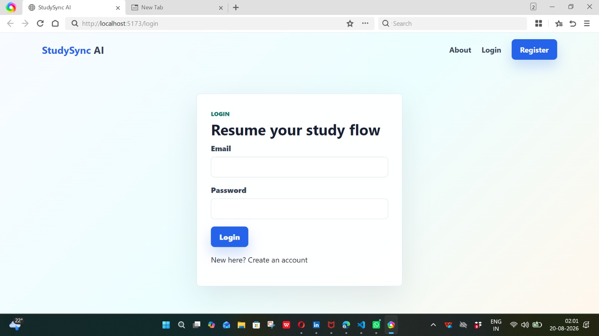
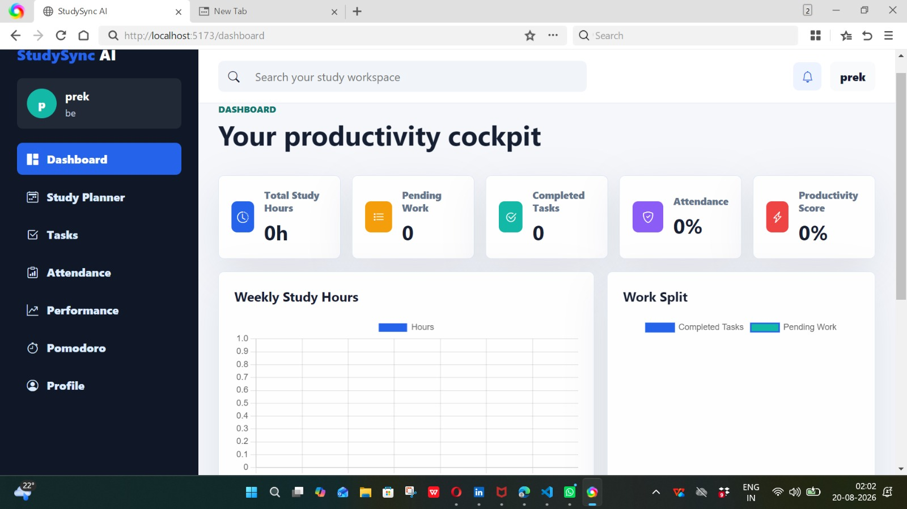
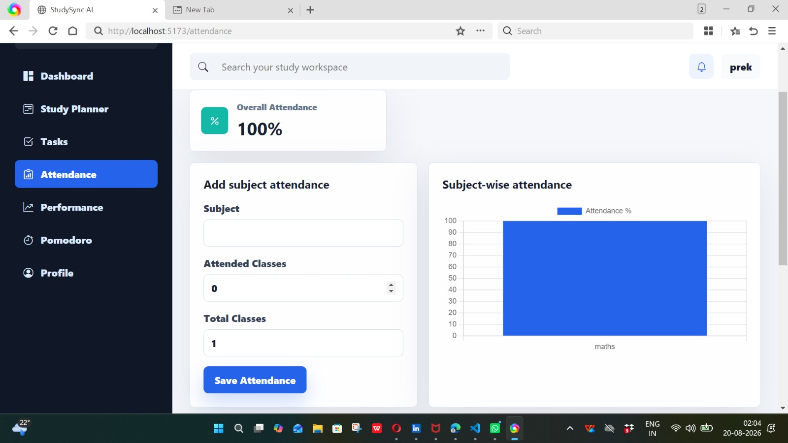
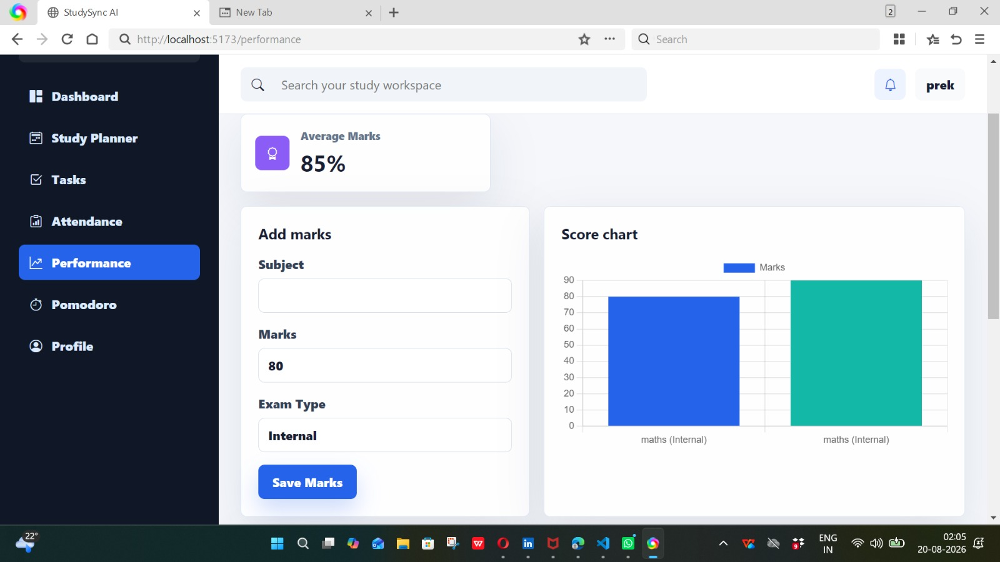
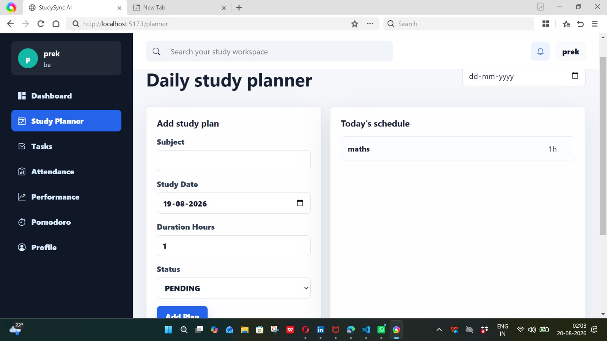
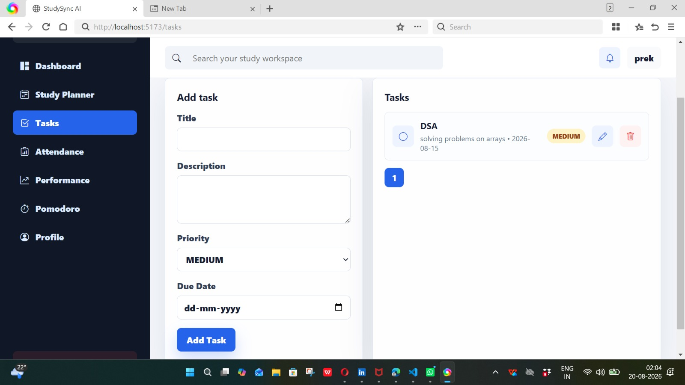

StudySync AI – Smart Study Planner & Productivity Tracker

StudySync AI is a full-stack study management and productivity platform designed to help students plan their studies, manage tasks, track attendance, monitor academic performance, and improve focus through Pomodoro sessions.

The application is built with Spring Boot, React, and MySQL, with secure JWT-based authentication and a responsive dashboard for tracking academic productivity.

✨ Key Features

- 🔐 User registration and login with JWT authentication
- 🔒 BCrypt password hashing and protected REST APIs
- 📊 Personalized productivity dashboard
- 📅 Study planner with date-based filtering and completion tracking
- ✅ Task management with search, priority, pagination, status, edit, and delete
- 📚 Subject-wise attendance tracking with percentage calculations
- ⚠️ Attendance warnings for subjects below 75%
- 📈 Subject performance tracking with marks and analytics
- 📊 Charts for study hours, tasks, attendance, and academic performance
- 🍅 Pomodoro focus timer with focus session tracking
- 👤 User profile management
- 📱 Responsive React-based user interface
- 🔑 User-specific data access and protected endpoints

🛠️ Tech Stack

Backend

- Java 17
- Spring Boot
- Spring Security
- JWT
- Spring Data JPA
- Hibernate
- Maven

Frontend

- React
- React Router DOM
- Axios
- Chart.js
- Bootstrap Icons
- Vite

Database

- MySQL

🏗️ Project Architecture

StudySync-AI/
│
├── backend/
│   ├── src/
│   │   └── main/
│   │       ├── java/com/studysyncai/
│   │       │   ├── config/
│   │       │   ├── controller/
│   │       │   ├── dto/
│   │       │   ├── entity/
│   │       │   ├── exception/
│   │       │   ├── repository/
│   │       │   ├── security/
│   │       │   └── service/
│   │       └── resources/
│   └── pom.xml
│
├── frontend/
│   ├── src/
│   │   ├── components/
│   │   ├── context/
│   │   ├── layouts/
│   │   ├── pages/
│   │   ├── routes/
│   │   ├── services/
│   │   └── utils/
│   ├── package.json
│   └── vite.config.js
│
├── database.sql
├── .gitignore
└── README.md

🗄️ Database Setup

Create the MySQL database:

CREATE DATABASE studysync_ai;

Alternatively, import the provided SQL file:

mysql -u root -p < database.sql

Then configure your MySQL credentials in:

backend/src/main/resources/application.properties

The application uses Hibernate's:

spring.jpa.hibernate.ddl-auto=update

so the required tables can be created or updated automatically when the backend starts.

⚙️ Backend Setup

Navigate to the backend:

cd backend

Install/build the project:

mvn clean install

Start the Spring Boot application:

mvn spring-boot:run

The backend API runs at:

http://localhost:8090

💻 Frontend Setup

Open another terminal and navigate to the frontend:

cd frontend

Install dependencies:

npm install

Create/configure the environment file:

.env

Add:

VITE_API_URL=http://localhost:8090/api

Start the React development server:

npm run dev

The frontend runs at:

http://localhost:5173

🔑 Authentication

The application uses JWT-based authentication.

After successful login, the client uses the JWT token when accessing protected APIs.

Protected requests use:

Authorization: Bearer <jwt-token>

🔗 API Overview

Authentication

POST /api/auth/register
POST /api/auth/login

Study Plans

GET    /api/study-plans
GET    /api/study-plans?date=2026-05-01
POST   /api/study-plans
PUT    /api/study-plans/{id}
DELETE /api/study-plans/{id}

Tasks

GET    /api/tasks?search=&page=0&size=8
POST   /api/tasks
PUT    /api/tasks/{id}
DELETE /api/tasks/{id}

Attendance

GET  /api/attendance
POST /api/attendance

Performance

GET  /api/performance
POST /api/performance

Dashboard & Profile

GET /api/dashboard
GET /api/profile
PUT /api/profile

## 📸 Screenshots

### Login

### Dashboard

### Attendance

### Performance

### Study Planner

### Tasks

🎯 Project Highlights

This project demonstrates practical experience with:

- Full-stack application development
- REST API development using Spring Boot
- JWT authentication and Spring Security
- CRUD operations
- Spring Data JPA and Hibernate
- MySQL database integration
- DTO-based API design
- Exception handling and validation
- Pagination and search
- User-specific data access
- React component-based UI development
- API integration using Axios
- Data visualization using Chart.js
- Responsive web application development

🚀 Future Enhancements

- AI-powered personalized study recommendations
- Email or notification reminders
- Advanced productivity analytics
- Study streak tracking
- Calendar integration
- Deployment with cloud-based database and hosting

👩‍💻 Author

Prekshitha GL

- GitHub: "prekshithagl" (https://github.com/prekshithagl)
- LinkedIn: "Prekshitha GL" (https://www.linkedin.com/in/prekshitha-gl-535294366)

📄 License

This project is developed for educational and portfolio purposes.